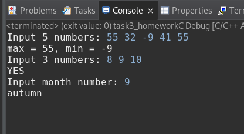

# Домашнее задание №3
## Задача 1. Наибольшее из пяти чисел
Ввести пять чисел и вывести наибольшее из них  
- Нужно напечатать наибольшее число
- Данные на входе: Пять целых чисел разделенных пробелом
- Данные на выходе: Одно целое число
- Данные на входе: 4 15 9 56 4
- Данные на выходе: 56
## Задача 2. Наименьшее из пяти чисел
Ввести пять чисел и вывести наименьшее из них
- Нужно напечатать наименьшее число
- Данные на входе: Пять целых чисел разделенных пробелом
- Данные на выходе: Одно целое число
- Данные на входе: 4 15 9 56 4
- Данные на выходе: 4
## Задача 3. В порядке возрастания
Ввести три числа и определить, верно ли, что они вводились в порядке
возрастания.
- Данные на входе: Три целых числа
- Данные на выходе: Одно слово YES или NO
- Пример
- Данные на входе: 4 5 17
- Данные на выходе: YES
## Задача 4. Какое время года
Ввести номер месяца и вывести название времени года.
- Данные на входе: Целое число от 1 до 12 - номер месяца.
- Данные на выходе: Время года на английском: winter, spring, summer, autumn
- Пример №1
- Данные на входе: 4
- Данные на выходе: spring
- Пример №2
- Данные на входе: 1
- Данные на выходе: winter

## Результат:
